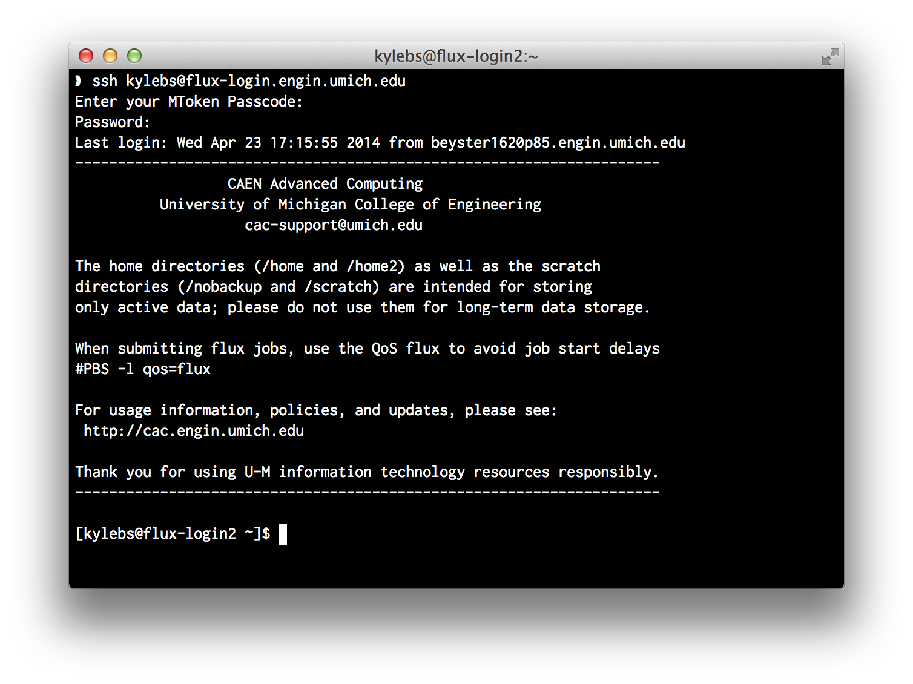

Flux Login Servers
==================

At this point, you should be ready to log into Flux! Congratulations!
Before proceeding, please __make sure you have the following:__

- Obtained and activated an MToken
- Completed the Synopsys off-campus license terms agreement
- Registered for an HPC User account
- Received confirmation details for your Flux allocation, including:
  - Project name (eg: `some-uniqname_flux`)
  - Authorized users list (just make sure you're on it!)

If you are missing *any* of the above, please go back and review the previous
chapters. You will need __all__ off these things to submit a job!


## SSH Into a Flux Login Server
The [login nodes](http://cac.engin.umich.edu/resources/login-nodes) for Flux
are accessible via hostname at `flux-login.engin.umich.edu`. Make sure you're
__on campus__ and issue the following command:

```sh
$ ssh your-uniqname@flux-login.engin.umich.edu
```

If all goes well, you will be prompted for an MToken code, followed by your
password. If you see the following welcome banner (or something like it), give
yourself a high five!




## Login Server Guidelines
Remember that the [login nodes](http://cac.engin.umich.edu/resources/login-nodes)
are intended for just that: logging in and submitting jobs to the cluster. You
should __never run resource-intensive commands at the login shell__; that's what
the worker nodes are for!

If you need to run an interactive script that _is_ resource intensive (can't
think of any reason you'd do this in EECS 470),
[submit an interactive job](http://cac.engin.umich.edu/resources/systems/nyx/pbs#interactive).

<br>
### Protips
If, like me, typing out `flux-login.engin.umich.edu` over and over annoys you,
open `~/.ssh/config` with your favorite editor and add the following lines:

```ssh
Host flux
  Hostname flux-login.engin.umich.edu
  User your-uniqname
```

Now when you want to log into Flux, you need only type:

```sh
$ ssh flux
```

If you'd like to try setting up [SSH multiplexing](http://en.wikibooks.org/wiki/OpenSSH/Cookbook/Multiplexing),
CAC has a mini-guide on the
[two factor authentication page](http://cac.engin.umich.edu/resources/login-nodes/tfa#TOC-Multiplexing-an-SSH-session)


<br><br><hr/>
#### Useful Links
- <http://cac.engin.umich.edu/resources/login-nodes>
