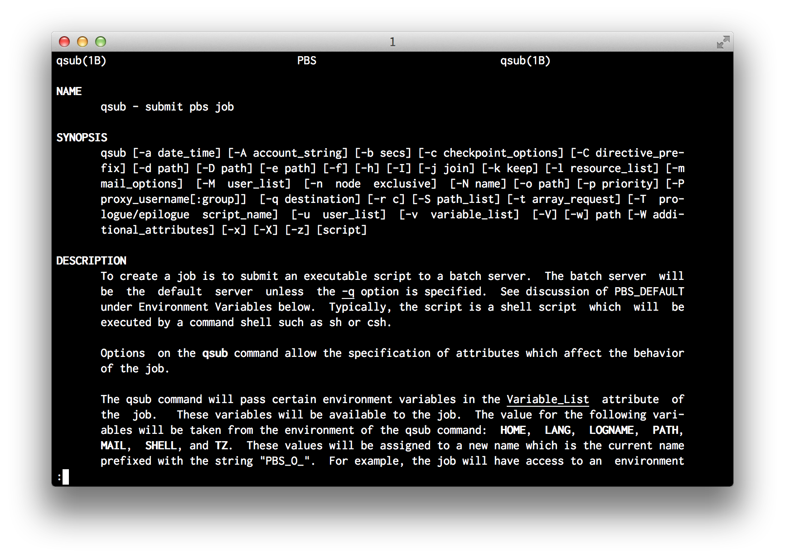
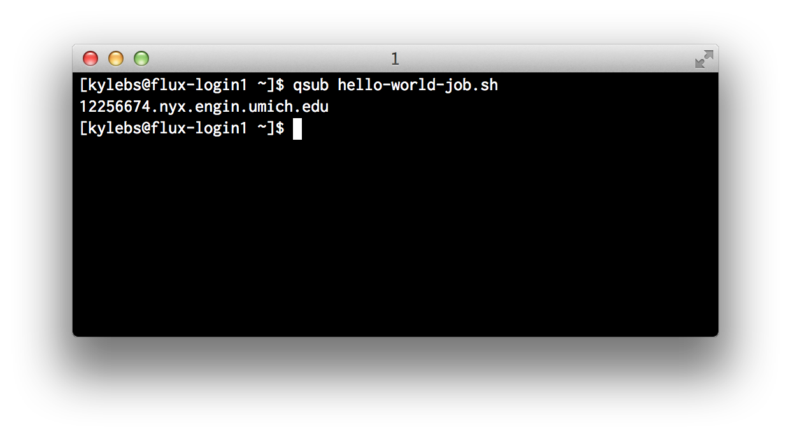
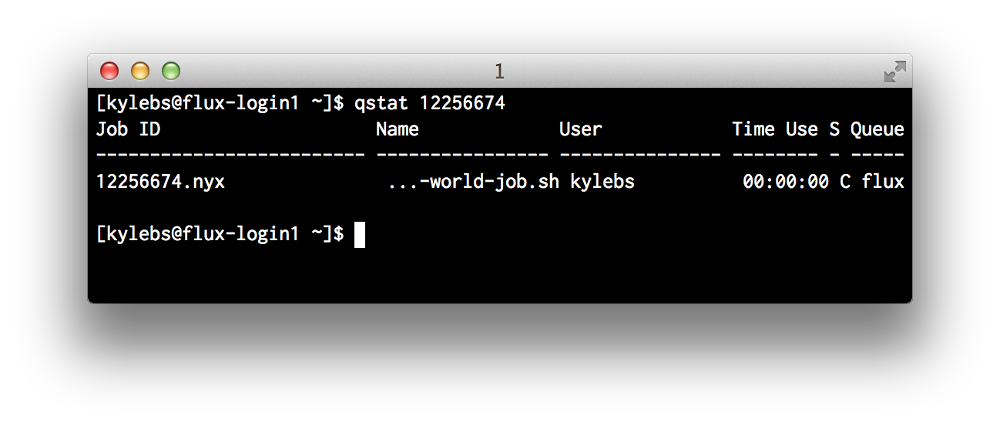
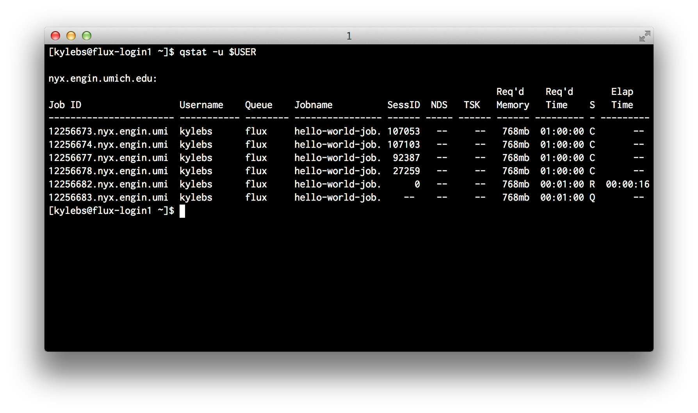
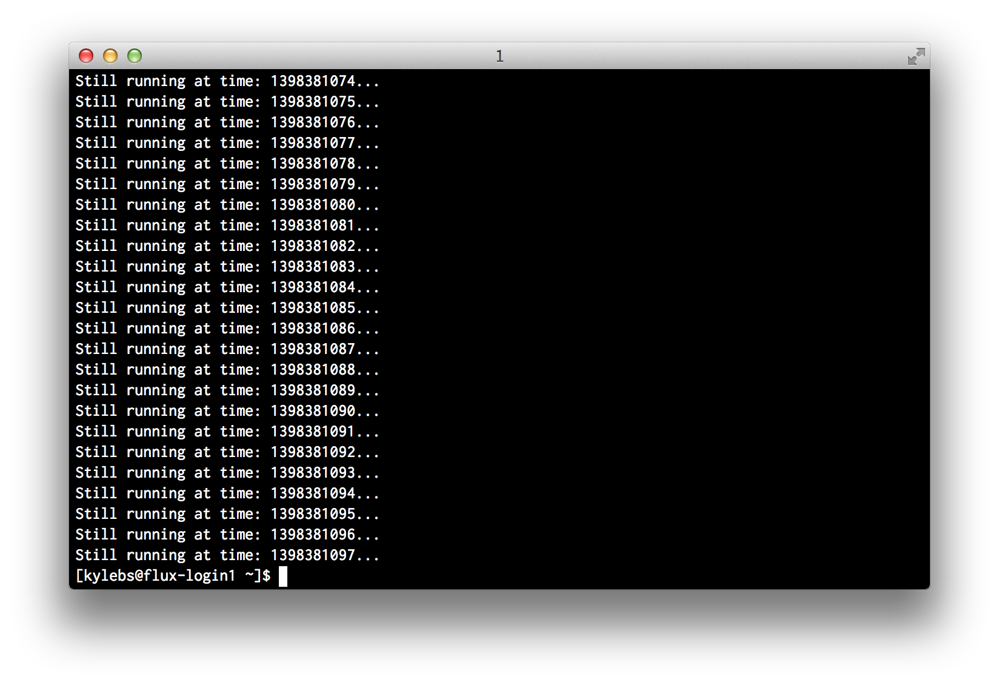
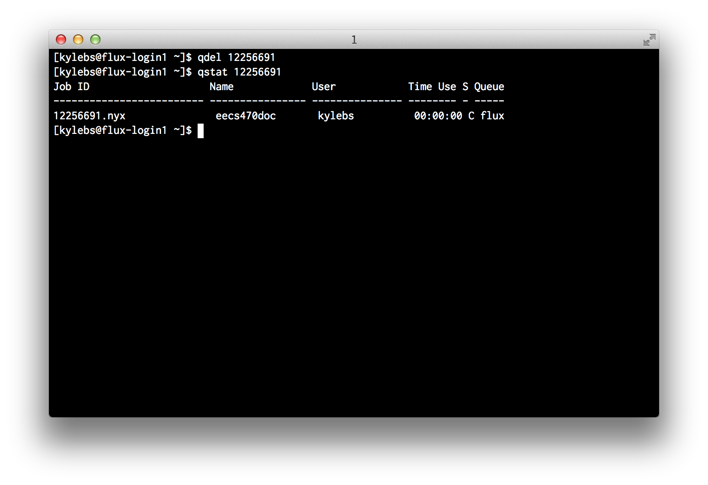

PBS and Useful Tools
====================

Working with batch jobs can be challenging. It's important to have a solid
understanding of the tools available, and, even more importantly, to know where
to find more information when necessary.

There's a [great list of common commands](https://docs.google.com/a/umich.edu/viewer?a=v&pid=sites&srcid=dW1pY2guZWR1fGVuZ2luLWNhY3xneDpjYmRlMGQyMzVlY2FhYjg)
provided by CAC available online at:
- <https://docs.google.com/a/umich.edu/viewer?a=v&pid=sites&srcid=dW1pY2guZWR1fGVuZ2luLWNhY3xneDpjYmRlMGQyMzVlY2FhYjg>.

This section attempts to quickly cover the basics of PBS to get you up and running ASAP.


### 1. Submitting jobs with `qsub`

`qsub` allows you to submit new jobs. A super brief example of this was shown
in the previous section.

A quick view of the man page (`man qsub`) reveals a frightening number of flag
modifiers:



While *most* flags are optional, __all__ jobs __*must*__ specify Queue (`-q`),
Account (`-A`), and Quality of Service (QOS) (`-l qos=[name]`). Hopefully this
seems familiar and you've realized that those strange comments in our
`hello-world-job.sh` script were simply a *different* way to pass these
required job attributes to the scheduler. We could submit the original "Hello
World" script (shown below) using `qsub hello-world-job.sh`, __or__ we could
remove all those comment directives and pass them into the `qsub` command
directly.

On a successful call to `qsub`, the job ID is returned to `STDOUT`:



#### Using in-file comment directives
```bash
#!/bin/bash
##### The original hello-world-job.sh script
#PBS -A brehob_flux
#PBS -l qos=flux
#PBS -q flux

echo "Hello World!"
```

Submit `hello-world-job.sh` using: `qsub hello-world-job.sh`. __OR__ use the
modified verison below:

```bash
$ qsub hello-world-job.sh
```

#### Using command-line flags
```bash
#!/bin/bash
##### hello-world-job-nocomments.sh with the comment directives removed
echo "Hello World!"
```

And submit `hello-world-job-nocomments.sh` using: `qsub -A brehob_flux -l qos=flux -q flux hello-world-job-nocomments.sh`

```bash
$ qsub -A brehob_flux -l qos=flux -q flux hello-world-job-nocomments.sh
```

#### Which way is best?
There's no good answer. If you have a job that will always be submitted with
the exact same attributes and doesn't need to be flexible, why not hardcode
them to prevent dumb mistakes? If you want to be able to invoke the job script
from a "helper" script (like our `pre-sub.sh` script from earlier), then you'll
need to use command line flags, as the comment directives won't allow for
variable expansion (because they're *comments*).


### 2. Checking jobs with `qstat`
`qstat` allows you to check the status of submitted jobs. Running with no args
is practically useless as it will dump every job on every queue from every
user. There are two cases where you'll commonly use `qstat`:
- Check the status of a specific job
- View all of your jobs

#### Checking a Specific Job (By Job ID)
```bash
# check a specific job with ID 12256674
$ qstat 12256674
```


As you can see, qstat gives us back some basic information about the requested job:
- Job ID
- Job Name (specified with `-N [name]`)
- User that submitted the job
- Time Use (for currently-running jobs, the amount of time the job has been running)
- S, or Status (Primary states are: `C` for completed, `Q` for queued, and `R`
  for running. See the man page for a list of all possible states)
- Queue describes which worker queue the job was submitted to


#### Checking All Jobs For a User
```bash
# check all jobs for a specific user, you!
$ qstat -u $USER
```


Very similar to the specific job status shown above but with some re-wording and the addition of:
- SessID, or SessionID (I have no idea what this is for)
- NDS, or Number of Nodes (specify with `-l nodes=X`)
- TSK, or Number of Tasks (CPUs) (specify with `-l procs=X` or `-l nodes=X:ppn=Y` where `ppn` stands for "Processors Per Node")


### 3. Introspect running jobs with `qpeek`

Often times, it's useful to be able to check on a long-running process to make
sure everything is executing as expected. A healthy mix of `echo` statements
in your job scripts and the occasional `qpeek` can be indispensible when it
comes down to identifying bugs in your jobs.

In the example below, I "accidentally" submit a job with an endless loop and
peek in on it to see what's going on.

```sh
$ qpeek 12256691
```



### 4. Cancelling jobs with `qdel`

Sometimes you need to cancel a job after it has been submitted. It _generally_
doesn't matter what state the job is currently in, so long as you are the
owner, you should be able to cancel it with `qdel`.

In the example above with `qpeek`, we saw that looper was mis-behaving. We can
use `qdel` to kill that job, make the necessary changes, and resubmit:

```bash
# kill job 12256691
$ qdel 12256691
```



## Handy One-liners
Here are a few handy bash one-liners I like to use when working with PBS:
```bash
# leave a terminal open with this running to constantly montior my jobs
$ while [ 1 ]; do qstat -u $USER; sleep 1; done

# list all jobs in a CSV-ish format that's easy to parse
$ qstat -u $USER | grep -E '^[0-9]+' | tr -s '[:blank:]' ','

# list all jobs that aren't complete
$ qstat -u $USER | grep -vE '00 C' | grep -E '^[0-9]+'

# find all of my queued jobs and kill them
$ qstat -u $USER | grep -E '^[0-9]+' | tr -s '[:blank:]' ',' | cut -d',' -f1,10 | grep -E 'Q$' | cut -d'.' -f1 | xargs -I {} qdel {}

# find all of my running jobs and kill them
$ qstat -u $USER | grep -E '^[0-9]+' | tr -s '[:blank:]' ',' | cut -d',' -f1,10 | grep -E 'R$' | cut -d'.' -f1 | xargs -I {} qdel {}
```


## Useful Links
- CAC PBS Guide for nyx: <http://cac.engin.umich.edu/resources/systems/nyx/pbs>
- CAC General PBS Guide: <http://cac.engin.umich.edu/resources/software/pbs>
- *Free* HPC Video Tutorials: <http://arc.research.umich.edu/training-workshops/online-training-resources/>
- CAC *nix Quick Reference Sheet: <https://docs.google.com/a/umich.edu/viewer?a=v&pid=sites&srcid=dW1pY2guZWR1fGVuZ2luLWNhY3xneDpjYmRlMGQyMzVlY2FhYjg>
