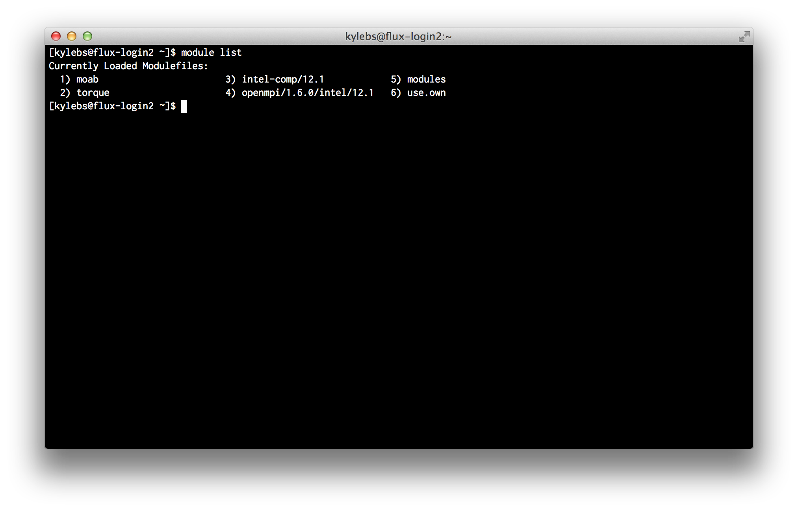
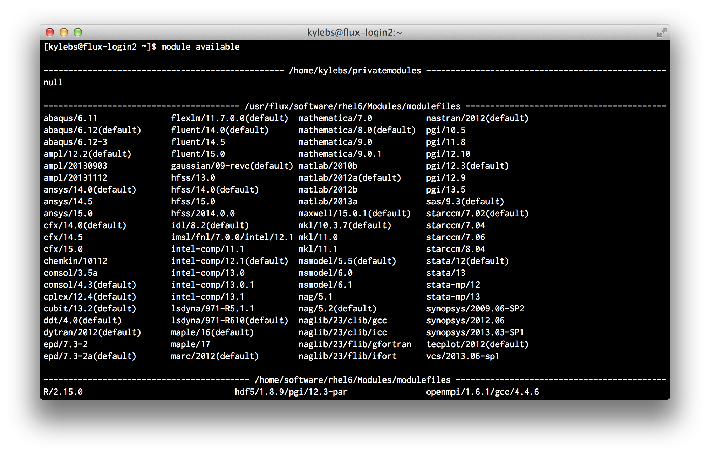
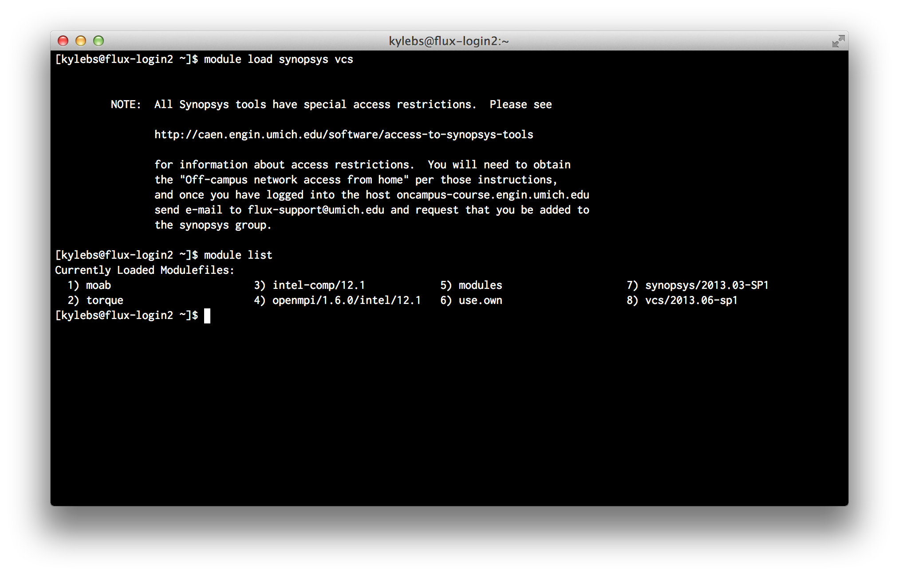
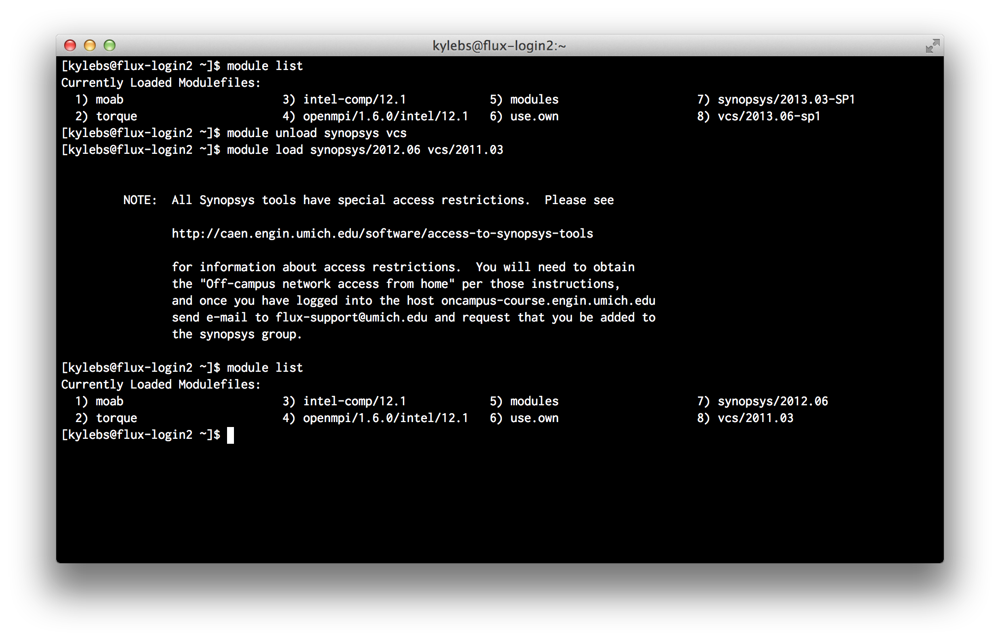

Writing Job Scripts
===================

Now that you can access the login nodes, it's time to start writing job
scripts. Job scripts are what you submit to the job scheduler to be put in the
worker queue. On Flux, we use
[Portable Batch System (PBS)](http://en.wikipedia.org/wiki/Portable_Batch_System)
(covered in more detail next chapter). For EECS 470, our job scripts will be
simple shell scripts that __copy files__ and __invoke
[`make`](https://www.gnu.org/software/make/)__.

## Quick Disclaimer
__This isn't supposed to be a guide on shell scripting__. If
you already have a good handle on command-line tools like `make`, understanding
job scripts should be cake; however, if you don't feel comfortable with the
Black Screen of Wonder™, you should copy-paste the example code provided later
on, *OR* find a friend and work through it. __I won't spend time__ explaining
__standard commands__ or __scripting practices__. If you want to strengthen your
BASH-fu, you might consider spending some time reverse-engineering posts on
[commandlinefu.com](http://www.commandlinefu.com/).


## Hello World
No guide would be complete without a "Hello World" example, so here's ours.
Consider the below shell script, titled `hello-world-job.sh`:

```bash
#!/bin/bash
#PBS -A brehob_flux
#PBS -l qos=flux
#PBS -q flux

echo "Hello World!"
```

As you can see, short of those 3 weird `#PBS` comment lines, this is just your
regular old, run-of-the-mill bash script. We'll cover _how_ to submit this job
in the next section. For now, __assume that running this job produces 2 new text
files__ in the working directory: `hello-world-job.sh.o12253000` and
`hello-world-job.sh.e12253000`.

### Log Files
You seem like a smart person; I'm guessing you've figured out that it's no
coincidence they're named `{job-script}.{'o' or 'e'}{numbers}`. The
default behavior of PBS is to dump two files into the directory that the job
was __submitted from __. The `{numbers}` portion of the filename is the __Job
ID__ which is established by PBS for tracking purposes and returned to the user
upon successful submission. The `{'o' or 'e'}` portion indicates that these
files contain the "output" and "error" logs, respectively. Remember how we said
PBS runs "unattended programs?" Since we can't (generally speaking) watch
`STDOUT` and `STDERR` while a job is running, PBS pipes everything from
`STDOUT` into the `{'o'}` log and everything from `STDERR` into the `{'e'}`
log. This way, we can review what the program printed to the terminal while we
weren't watching.

#### TL;DR
`./le-job 1> le-job.sh.o1234567 2> le-job.sh.e1234567`

### Job Attributes
Let's turn your attention back to those 3 weird lines that start with `#PBS`.
These are obviously comments of some sort (the line *does* starts with a `#`),
but what are they and why do we need them for our simple "Hello World" job?
__These comments__ are __special directives__ to the job scheduler that specify
[job attributes](http://cac.engin.umich.edu/resources/software/pbs#TOC-The-PBS-script-parameters).
There are many attributes that you can set and a full list is available on the
[CAC PBS reference page](http://cac.engin.umich.edu/resources/software/pbs).

While many attributes are optional, __all__ jobs __*must*__ specify Queue,
Account, and Quality of Service (QOS). Queue and QOS should stick to the
default values listed below while Account should use the allocation name you
were given via email.
- Queue `-q flux`
- Account `-A {your allocation name here}`
- Quality of Service (QOS) `-l qos=flux`

### Job Restrictions & Limitations
At this point, it's probably a good idea to describe some of the restrictions
and limitations on jobs. As you tweak and develop job scripts for *your*
projects, keep the following in mind.

+ __No internet access inside jobs__. While you can access the interwebs from the login nodes,
   jobs are sandboxed. For the record, I can't find any reference that confirms
   this fact, but I certainly witnessed and experienced it.

   *If* you simply need to grab something from the interwebs before the job
   runs (eg: clone a repository, grab the latest copy of some external file),
   you can wrab the actual job script with a job "submission" script that will
   perform these tasks *before* the job enters the queue.


+ __No automatic [AFS](http://www.itcs.umich.edu/itcsdocs/r1070/) access__.
   Meaning, by default, the Flux login nodes do *not* generate AFS
   [tokens](http://www.itcs.umich.edu/scs/long.php) for you. If you need to
   access AFS space, you'll need to obtain the appropriate AFS tokens manually:

   ```sh
   # list current tokens
   $ tokens

   # if "--End of list--" is displayed with no tokens, then you need to generate a token
   $ aklog -c umich.edu

   # now, unless something went wrong, you should have a token
   $ tokens
   ```

   Fair warning that this *may* require you to enter your password, which means
   you should definitely keep this out of job scripts. Entering passwords into
   scripts == sketchy.

    If you need something from AFS space for a job, obtain a token at the login
   shell and wrap the job script a job "submission" script (same as #1 above).


+ Accessing AFS and __network space is *super* slow__ and could easily become
   a bottleneck in your batch jobs. Fortunately, HPC provides us with some
   "scratch storage" space. 640TB of high-speed scratch storage space to be
   exact. Therefore, it's a good idea (and best practice) to copy any files
   needed by your job to your scratch space *before* the job executes (eg:
   using a job "submission" script again).

   Every authorized user on a project is granted scratch space in
   `/scratch/{account}/{user}`. For example, my scratch space in Dr. Brehob's
   trial allocation is located in `/scratch/brehob_flux/kylebs`.

### Environment Modules
Flux is an incredibly complex system and must support the needs of many users.
Due to the nature of High Performance Computing, the HPC Group has to be
extremely careful with software versioning; many jobs will run for weeks,
months, and even years.

In order to better-accommodate the wide range of users and software
requirements (versions), Flux makes use of
[environment modules](http://cac.engin.umich.edu/resources/software/environment-modules)
to __dynamically load and unload__ common __software packages__.

As a user of Flux, you need to be aware of this because, as you'll soon find,
just because a software package is *installed* (available), does __NOT__ mean
it's accessible for use (loaded). __Synopsys is an example of one package that
is available but *NOT* loaded by default__.

More command line tools will be covered in the next section; however, since you
need to understand `module` to work through the next example job, lets quickly
describe it here. We'll be looking at the 4 most-common commands: `list`,
`available`, `load`, and `unload`.

1. __`list`:__ List packages that are currently loaded into the environment:
   ```sh
   $ module list
   ```

   

2. __`available`:__ List packages that are installed but _not_ currently
   loaded:
   ```sh
   $ module available
   ```

   

3. __`load`:__ Load an _available_ package into the current environment. For
   example, to load the default version of synopsys and vcs:
   ```sh
   $ module load synopsys vcs
   ```

   

   As you can see, `2013.03-SP1` and `2013.06-sp1` are the default versions of
   Synopsys and VCS, respectively.

4. __`unload`:__ Remove a loaded package from the current environment. For
   example, to unload the current versions of synopsys and vcs:
   ```sh
   $ module unload synopsys vcs
   ```

   And to specifically load in older versions by tag:
   ```sh
   $ module load synopsys/2012.06 vcs/2011.03
   ```

   

   As you can see, we unload `2013.03-SP1` and `2013.06-sp1` and load in legacy
   versions `2012.06` and `2011.03`.


## Simple 2-Script Synthesis Job

Now that we've covered the fundamentals, let's consider a basic synthesis job
that uses 2 different scripts (a very common structure):
- 1 for pre-submission file operations
- 1 for the actual job

*NOTE: If run as-is, __this job will fail__! Keep reading to find out why*

Here's the pre-submission script, `pre-sub.sh`:
```sh
#!/bin/bash

export JOB_SCRIPT=job-script.sh
export PROJ_DIR=`pwd`
export SCRATCH_SPACE="/scratch/brehob_flux/$USER"

# Need to load synopsys and vcs modules
module load synopsys/2013.03-SP1
module load vcs/2013.06-sp1

echo "Submitting job..."
JOB_ID=`qsub $JOB_SCRIPT`
if [ "$?" -ne '0' ]; then
  echo "Error: Could not submit job via qsub"
  exit 1
fi

unset JOB_SCRIPT
unset PROJ_DIR
unset SCRATCH_SPACE

echo "JobID: $JOB_ID"
```

Here's the actual job script, `job-script.sh`:
```sh
#!/bin/bash
#PBS -S /bin/sh
#PBS -N eecs470synth
#PBS -A brehob_flux
#PBS -q flux
#PBS -l qos=flux,nodes=1:ppn=12,mem=47gb,pmem=4000mb,walltime=05:00:00
#PBS -V

# copy the project dir to the scratch space
temp_dir="$SCRATCH_SPACE/$PBS_JOBID"
mkdir -p "$temp_dir"
cd "$temp_dir"
cp -R "$PROJ_DIR" .
make syn
```

In a nutshell, to launch a new job, you'd move both scripts into the
root of your project directory and start the `pre-sub.sh` by running the
following command from the login shell:

```sh
$ ./pre-sub.sh
```

A few things would then happen:
1. `$PROJ_DIR` would be set to the current working directory (the one where you Makefile lives)
2. `$SCRATCH_SPACE` would be set to the absolute path to your scratch space. In this example, my allocation is named `brehob_flux`
3. Synopsys and VCS are loaded into the environment (specific versions are targeted)
4. A mysterious new command, `qsub`, is issued and the job is submitted. If the return code (`$?`) is anything besides `0`, then the job submission failed and we print an error message and exit.

Assuming the job was submitted and queded up successfully, then, sometime
later, a worker node would start `job-script.sh` and a few more things would
happen:
1. A few __new job parameters are used__, notably:
  - `-V`, which tells the scheduler to propagate the current enviornment (the
    one that submitted the job to begin with) into this one. This is __extremely
    important__ because it will make the exported environment variables (ie:
    `$PROJ_DIR` and `$SCRATCH_SPACE`) available to the job, _and_ will ensure
    that previously loaded modules (ie: Synopsys and VCS) are also available.
  - `-l nodes=1:ppn=12,mem47gb,pmem=4000mb,walltime=05:00:00`, which sets up
    the node architecture. [Bennet Fauber](mailto:bennet@umich.edu) did an
    excellent job at describing how these values affect the job performance;
    you can read an excerpt from
    [his email in the appendix](../appendices/bennet-node-config.md).
    Unless you've been gifted with a
    [high memory](http://arc.research.umich.edu/flux-and-other-hpc-resources/flux/flux-configuration/)
    allocation, stick to these defaults; they're tried and true.
2. A new directory is created in your scratch space with a name equal to the job's ID.
3. The project directory that the job was submitted from is copied to scratch space.
4. Synthesis is started by invoking `make syn`.

Now for the bad news: unfortunately, while this looks good and seems correct,
there are hidden dependencies in the synthesis files for Better Build System
that will cause synthesis to fail. Specifically, `scripts/default.tcl` contains
the following line of code:

```tcl
set search_path "/afs/umich.edu/class/eecs470/lib/synopsys/"
```

Essentially, __EECS 470 uses custom libraries__ that must be loaded in at synthesis
time. Since the files are __on AFS__, the __load will fail__ because, as we know, there
isn't a valid AFS token in the job enviornment.

Fortunately, there's an easy (but dirty) solution: __copy all the included files__
to the scratch space *before* the job executes, and use `sed` or another tool
to replace all instances of the old path with the new one. For now, just be
aware of this issue; we'll give some example code to take care of this in the
final chapter, "Practical Examples".


## Useful Links
- <http://cac.engin.umich.edu/resources/software/pbs>
- <http://cac.engin.umich.edu/resources/systems/nyx/pbs>
